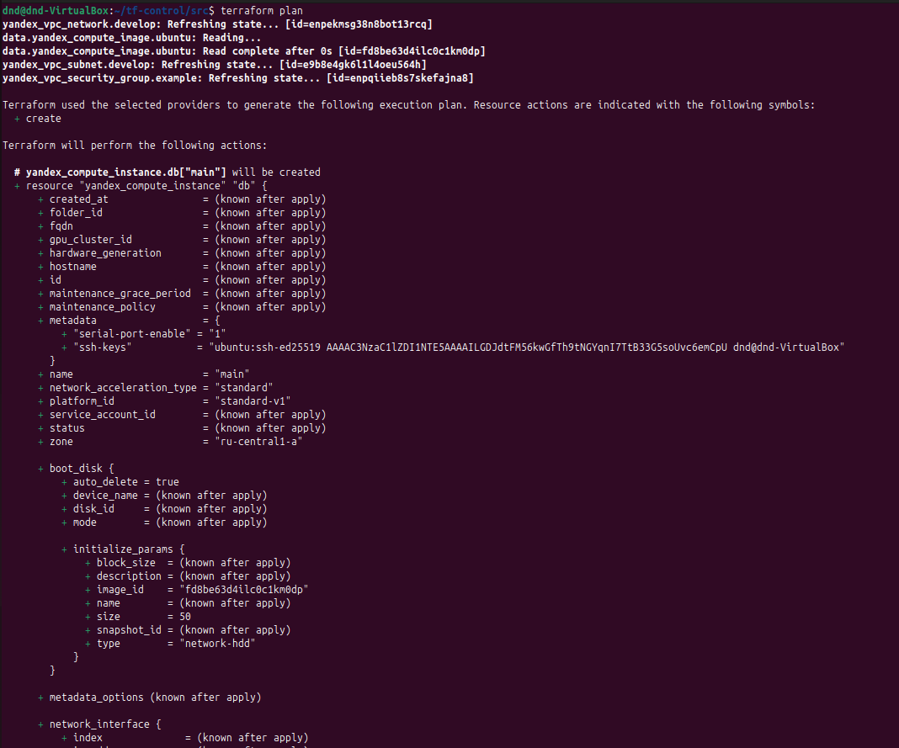
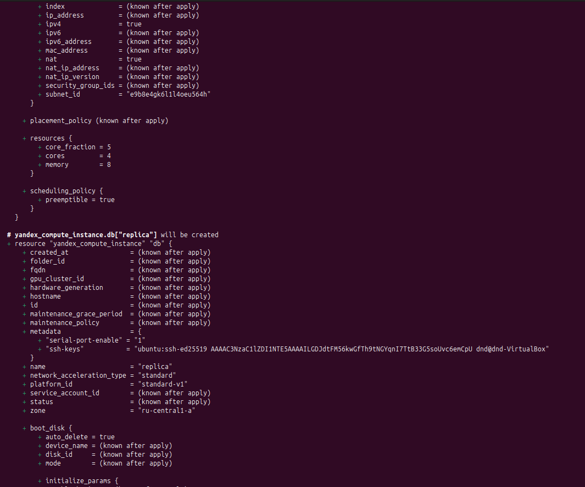
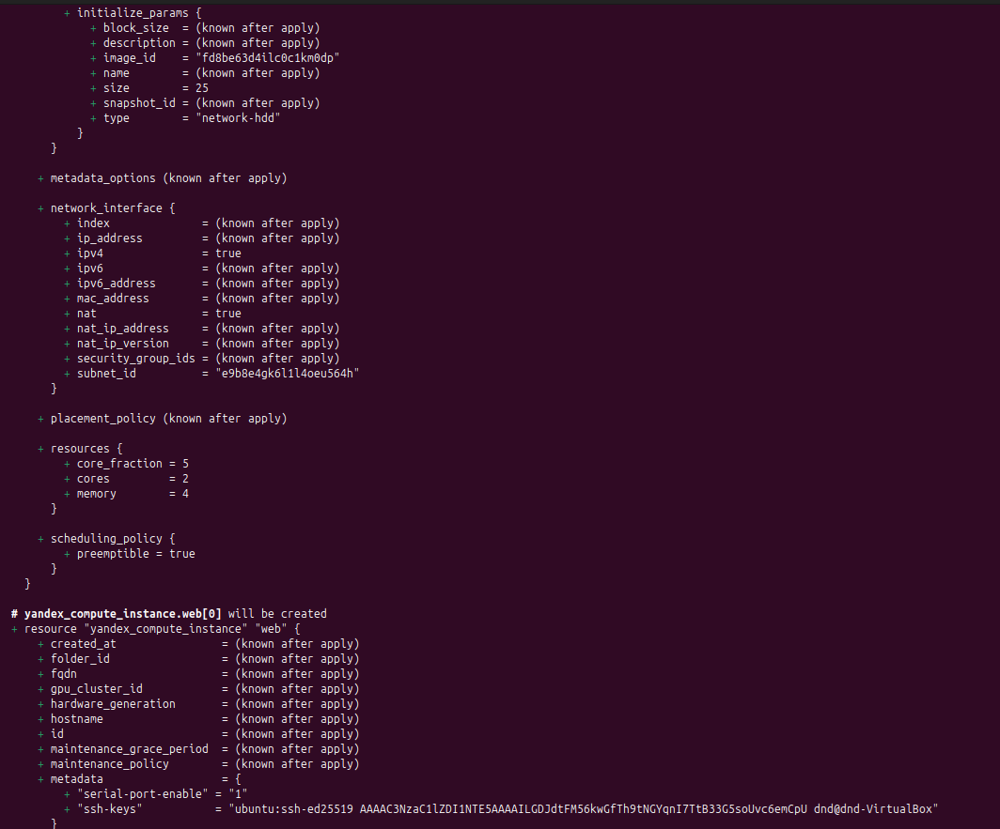
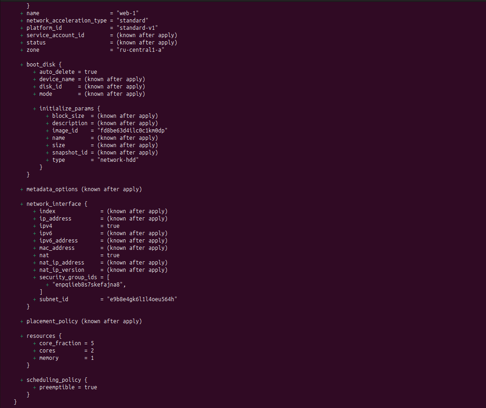
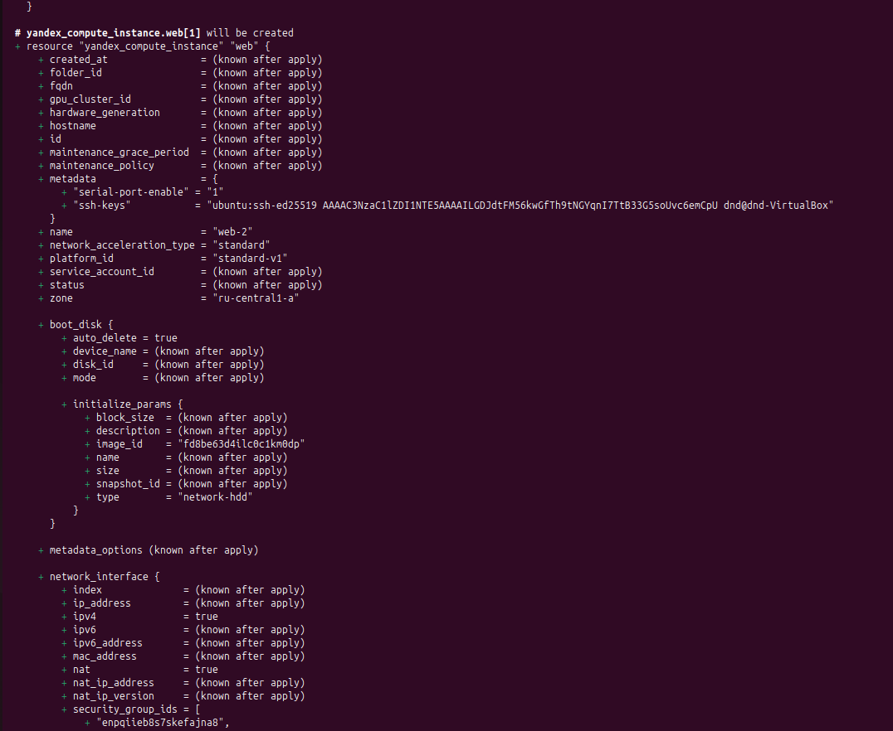

# Домашнее задание к занятию "`Управляющие конструкции в коде Terraform`" - `Дедюрин Денис`

---
## Задание 1.

1. Изучите проект.
2. Инициализируйте проект, выполните код. 

Приложите скриншот входящих правил «Группы безопасности» в ЛК Yandex Cloud .

### Ответ:

Для инициализации и выполнения кода проекта выполняем команды:

```
terraform init
```
```
terraform plan
```
```
terraform apply
```


После выполнения кода видим, что в Я.Облаке создались группа безопасности с именем **example_dynamic**.


---
## Задание 2

1. Создайте файл count-vm.tf. Опишите в нём создание двух **одинаковых** ВМ  web-1 и web-2 (не web-0 и web-1) с минимальными параметрами, используя мета-аргумент **count loop**. Назначьте ВМ созданную в первом задании группу безопасности.(как это сделать узнайте в документации провайдера yandex/compute_instance )
2. Создайте файл for_each-vm.tf. Опишите в нём создание двух ВМ для баз данных с именами "main" и "replica" **разных** по cpu/ram/disk_volume, используя мета-аргумент **for_each loop**. Используйте для обеих ВМ одну общую переменную типа:
```
variable "each_vm" {
  type = list(object({  vm_name=string, cpu=number, ram=number, disk_volume=number }))
}
```  
При желании внесите в переменную все возможные параметры.
4. ВМ из пункта 2.1 должны создаваться после создания ВМ из пункта 2.2.
5. Используйте функцию file в local-переменной для считывания ключа ~/.ssh/id_rsa.pub и его последующего использования в блоке metadata, взятому из ДЗ 2.
6. Инициализируйте проект, выполните код.

### Ответ:

Создаем файлы **count-vm.tf** и **for_each-vm.tf** со следущим содержимым:

**count-vm.tf** 

```
resource "yandex_compute_instance" "web" {
  count = 2

  name  = "web-${count.index + 1}"
  zone  = var.default_zone

  resources {
    cores         = var.vms_resources.web.cores
    memory        = var.vms_resources.web.memory
    core_fraction = var.vms_resources.web.core_fraction
  }

  boot_disk {
    initialize_params {
      image_id = data.yandex_compute_image.ubuntu.image_id
    }
  }

  network_interface {
    subnet_id          = yandex_vpc_subnet.develop.id
    nat                = true
    security_group_ids = [yandex_vpc_security_group.example.id]
  }

  metadata = var.metadata

  scheduling_policy {
    preemptible = var.vm_preemptible
  }

  depends_on = [yandex_compute_instance.db]
}
```

**for_each-vm.tf**

```
resource "yandex_compute_instance" "db" {
  for_each = { for vm in var.each_vm : vm.vm_name => vm }

  name  = each.value.vm_name
  zone  = var.default_zone

  resources {
    cores         = each.value.cpu
    memory        = each.value.ram
    core_fraction = each.value.core_fraction
  }

    boot_disk {
    initialize_params {
      image_id = data.yandex_compute_image.ubuntu.image_id
      size     = each.value.disk_volume
    }
  }

  network_interface {
    subnet_id = yandex_vpc_subnet.develop.id
    nat       = true
  }

  scheduling_policy {
    preemptible = var.vm_preemptible
  }

  metadata = var.metadata

}
```

Добавляем переменные в файл **variables.tf**:

```
variable "vm_preemptible" {
  type        = bool
  default     = true
  description = "Whether the VM is preemptible."
}

variable "vms_resources" {
  type = map(object({
    cores         = number
    memory        = number
    core_fraction = number
  }))
  description = "Resources VM"
}

variable "vm_image_family" {
  type        = string
  default     = "ubuntu-2004-lts"
  description = "Family of the image to use for the VM."
}

data "yandex_compute_image" "ubuntu" {
  family =  var.vm_image_family
}

variable "metadata" {
  type        = map(string)
  description = "Metadata VM"
}

variable "each_vm" {
  type = list(object({
    vm_name       = string
    cpu           = number
    ram           = number
    disk_volume   = number
    core_fraction = number
  }))
  default = [
    { vm_name = "main",   cpu = 4, ram = 8,  disk_volume = 50, core_fraction = 5},
    { vm_name = "replica", cpu = 2, ram = 4,  disk_volume = 25,  core_fraction= 5}
  ]
}
```

В файл **terraform.tfvars** так же добавляем переменную с ключом:

**terraform.tfvars**

```
vms_resources = {
    web = { 
        cores         = 2
        memory        = 1
        core_fraction = 5
    }
}

metadata = {
    serial-port-enable = 1
    ssh-keys           = "ubuntu:ssh-ed25519 AAAAC3NzaC1lZDI1NTE5AAAAILGDJdtFM56kwGfTh9tNGYqnI7TtB33G5soUvc6emCpU dnd@dnd-VirtualBox"
}
```

Выполняем команды:

```
terraform plan
```
```
terraform apply
```







После выполнения кода видим, что в Я.Облаке создались 4 ВМ с именами **web-1**, **web-2**, **replica** и **main**.


А также для двух ВМ **web-1** и **web-2** назначена группа безопасности **example_dynamic**:


---
## Задание 3

1. Создайте 3 одинаковых виртуальных диска размером 1 Гб с помощью ресурса yandex_compute_disk и мета-аргумента count в файле **disk_vm.tf** .
2. Создайте в том же файле **одиночную**(использовать count или for_each запрещено из-за задания №4) ВМ c именем "storage". Используйте блок **dynamic secondary_disk{..}** и мета-аргумент for_each для подключения созданных вами дополнительных дисков.

### Ответ:

Создаем файл **disk_vm** со следущим содержимым:

**disk_vm.tf**

```
resource "yandex_compute_disk" "vm_disks" {
  count       = 3
  name        = "disk-${count.index + 1}"
  zone        = var.default_zone
  size        = 1
  type        = "network-hdd"
}

resource "yandex_compute_instance" "storage" {
  name  = "storage"
  zone  = var.default_zone

  resources {
    cores         = var.vms_resources.storage.cores
    memory        = var.vms_resources.storage.memory
    core_fraction = var.vms_resources.storage.core_fraction
  }

  boot_disk {
    initialize_params {
      image_id = data.yandex_compute_image.ubuntu.image_id
    }
  }

  network_interface {
    subnet_id = yandex_vpc_subnet.develop.id
    nat       = true
  }

  metadata = var.metadata   

  scheduling_policy {
    preemptible = var.vm_preemptible
  }

  dynamic "secondary_disk" {
    for_each = yandex_compute_disk.vm_disks[*]
    content {
      disk_id = secondary_disk.value.id
    }
  }
}
```

**terraform.tfvars**

```
vms_resources = {
    web = { 
        cores         = 2
        memory        = 1
        core_fraction = 5
    },
    storage = {
        cores         = 2
        memory        = 2
        core_fraction = 5
    }
}

metadata = {
    serial-port-enable = 1
    ssh-keys           = "ubuntu:ssh-ed25519 AAAAC3NzaC1lZDI1NTE5AAAAILGDJdtFM56kwGfTh9tNGYqnI7TtB33G5soUvc6emCpU dnd@dnd-VirtualBox"
}
```

По традиции выполняем команды:

```
terraform plan
```
```
terraform apply
```


Проверяем что после выполнения кода появилось в Я.Облаке:

1. Создалась еще одна ВМ **storage**


2. И к ней подключены 2 диска **disk-1**, **disk-1** и **disk-1**


---
## Задание 4

1. В файле ansible.tf создайте inventory-файл для ansible.
Используйте функцию tepmplatefile и файл-шаблона для создания ansible inventory-файла из лекции.
Готовый код возьмите из демонстрации к лекции [**demonstration2**](https://github.com/netology-code/ter-homeworks/tree/main/03/demo).
Передайте в него в качестве переменных группы виртуальных машин из задания 2.1, 2.2 и 3.2, т.е. 5 ВМ.
2. Инвентарь должен содержать 3 группы и быть динамическим, т. е. обработать как группу из 2-х ВМ, так и 999 ВМ.
3. Добавьте в инвентарь переменную  [**fqdn**](https://cloud.yandex.ru/docs/compute/concepts/network#hostname).

``` 
[webservers]
web-1 ansible_host=<внешний ip-адрес> fqdn=<полное доменное имя виртуальной машины>
web-2 ansible_host=<внешний ip-адрес> fqdn=<полное доменное имя виртуальной машины>

[databases]
main ansible_host=<внешний ip-адрес> fqdn=<полное доменное имя виртуальной машины>
replica ansible_host<внешний ip-адрес> fqdn=<полное доменное имя виртуальной машины>

[storage]
storage ansible_host=<внешний ip-адрес> fqdn=<полное доменное имя виртуальной машины>
```
Пример fqdn: ```web1.ru-central1.internal```(в случае указания переменной hostname(не путать с переменной name)); ```fhm8k1oojmm5lie8i22a.auto.internal```(в случае отсутствия переменной hostname - автоматическая генерация имени,  зона изменяется на auto). нужную вам переменную найдите в документации провайдера или terraform console.
4. Выполните код. Приложите скриншот получившегося файла. 

Для общего зачёта создайте в вашем GitHub-репозитории новую ветку terraform-03. Закоммитьте в эту ветку свой финальный код проекта, пришлите ссылку на коммит.   
**Удалите все созданные ресурсы**.

### Ответ:

Создаем файл **ansible.tf** со следущим содержимым:

**ansible.tf**


